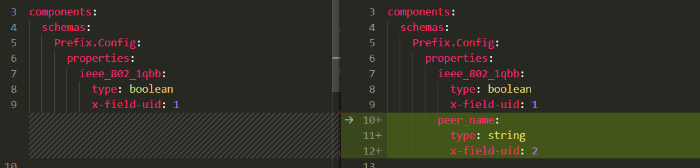
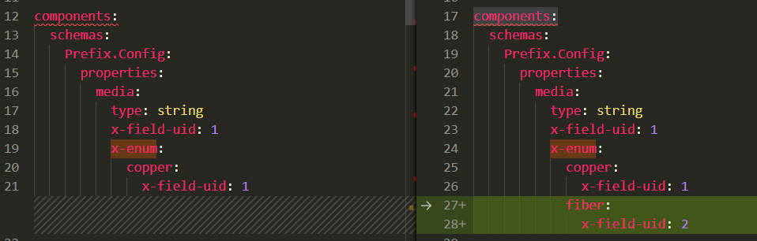
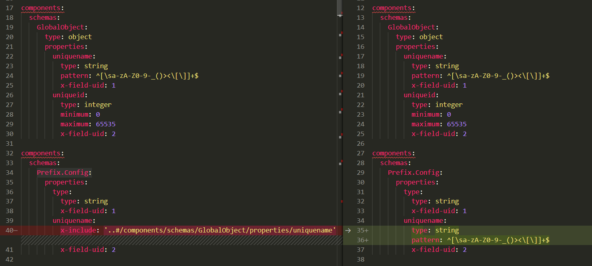
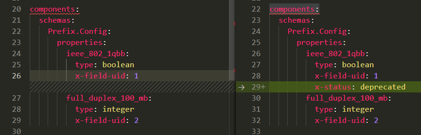
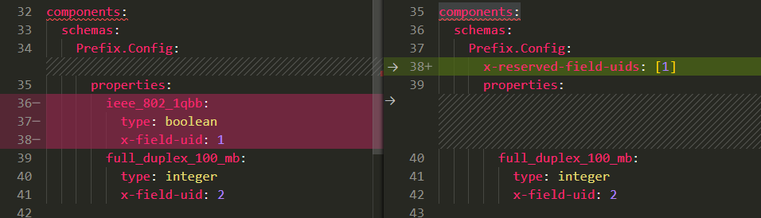
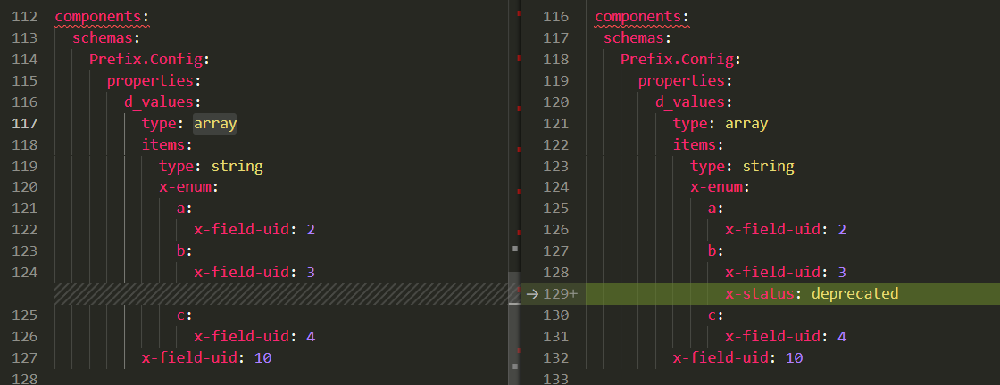
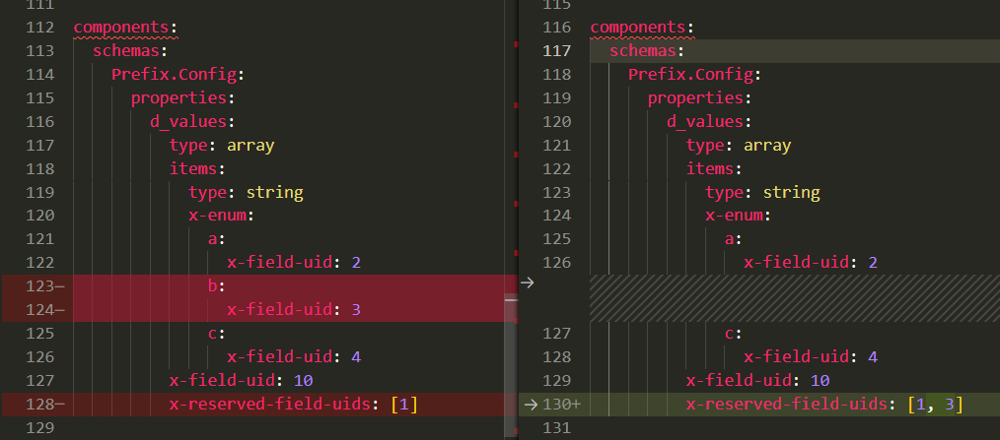
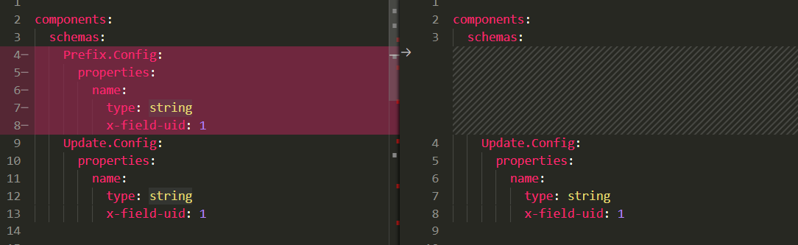
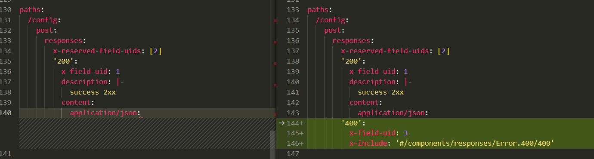

# Open Traffic Generator API & Data Modeling Guide

The Open Traffic Generator REST API is based on the [OpenAPI specification](
https://github.com/OAI/OpenAPI-Specification/blob/master/versions/3.0.3.md) which is a standard, language-agnostic interface to RESTful APIs.  

This document describes the philosophy and the best practices to be followed while developing the Open Traffic Generator API and Data Models.  The following topics are covered:

* [Philosophy](#philosophy)
* [Modeling Best Practices](#modeling-best-practices)
  * [Adding New APIs](#adding-new-apis)
  * [Properties](#properties)
  * [Naming](#naming)
  * [Keyword Limitations](#keyword-limitations)
  * [Keyword Extensions](#keyword-extensions)
  * [Descriptions](#descriptions)
* [Pull Requests](#pull-requests)

## Philosophy

* The APIs and Data Models are vendor agnostic.
  * To the extent possible, vendor specific terminologies are not to be used.
* The API is first and foremost an API for automation and not an API for a UI.
* The key goals for the API are:
  * Correctness & Robustness
  * User Experience for the Test Writer
  * Fast API Response Time
* When adding new capabilities, model for use-case(s), not features.
  * API and Data Model need to capture end user's intent.
  * Consequently, the fewest number of properties needed to satisfy the intent are added to the model *even if* the underlying implementation provides more options.
* Base model and Extension model(s)
  * The Open Traffic Generator Model comprises of "core capabilities" relevant to testing Layer 2-3 networking devices.
  * An Extension Model (eg. [convergence data model](https://github.com/open-traffic-generator/models-convergence)) comprises of methodologies built on top of the core model.

## Modeling Best Practices

* Before doing the actual modeling, write out the corresponding code in [gosnappi](https://pkg.go.dev/github.com/open-traffic-generator/snappi/gosnappi) (or [snappi](https://github.com/open-traffic-generator/snappi)) and configuration in JSON or YAML or [PbText](https://github.com/gogo/protobuf).  From the test writer's perspective consider whether it is easy to write, read and understand.  Include error handling in the sample code.  Rinse and repeat till the user experience is satisfactory.

### Adding New APIs

* Clearly define what the API call accomplishes.
  * Can somebody write tests solely based on API spec/doc without thinking about the specific implementation?
* Clearly define possible error conditions and steps to be taken in case of failure.
  * Goal is to make it easy to write robust tests.
* Consider whether they are 'blocking' or return immediately and require polling?  Is timeout implicit?
  * Do two consecutive API calls require polling between them?  If that is the case, rethink the APIs.
* Follow the principle "_If i want to get some information, there should be only one way to get it_".

### Properties

* Don't expose a property if it must always be a particular value (eg. prefix length for loopback IP addresses).
* Give descriptive names to properties, so that it’s apparent what value it is supposed to hold. e.g. `port_names` vs `port`
* Choose sensible values for default, min and max.
* Do not assign defaults to properties for which holding a null value has a meaning.
* Do not mark properties are required if they can hold sensible default values.
* Use proper `x-status`.

### Naming

* `property names` MUST be snake_case.
* `schema object names` MUST be PascalCase (upper camel case).
* `x-enum names` MUST be lowercase with underscores at natural word breaks.  Valid characters are `^[a-z0-9_]+$`.  x-enum names MUST start with an alphabetic character.
  * VALID: one_hundred_gbps
  * INVALID: 100_gpbs
* `namespaces` MUST be PascalCase (upper camel case) and use a `.` separator

  ```yaml
  # demonstrates how to specify an object within a namespace
  components:
    schemas:
      Router.Bgp.Advanced:
        type: object
  ```

* `schema`
  * top level `schema objects` should avoid properties as simple data types and strive to encapsulate those properties in an object to allow for future extensibility.

### Keyword Limitations

The build script will enforce the following keyword conventions:

* `oneOf`
  * MUST not be used.
  * This repository uses the `choice` property to discriminate between multiple objects at the same level.

  ```yaml
    # demonstrates how to model a choice
    components:
      schemas:
      Choice.Object:
        type: object
        properties:
          choice:
            type: string
            x-enum: 
              a:
                x-field-uid: 1
              b:
                x-field-uid: 2
              c:
                x-field-uid: 3
            default: a
          a:
            $ref: '#/components/schemas/Choice.A'
          b:
            $ref: '#/components/schemas/Choice.B'
          c:
            $ref: '#/components/schemas/Choice.C'
    ```

* `allOf`
  * MUST not be used.
  * Use the x-include extension instead.

* `description`
  * MUST be included for every schema object and schema property and include a meaningful description.

* `nullable`
  * MUST NOT be used.

### Keyword Extensions

* `x-status`
  * An extension keyword to indicate the status of a schema object or property.

  ```yaml
  components:
    schemas:
      Extensions:
        properties:
          x-status:
            type: object
            required: [status]
            properties:
              status:
                description: |-
                  - `current` means that the definition is current and valid.
                  - `deprecated` indicates an obsolete definition, but it permits new /
                  continued implementation  in order to foster interoperability
                  with older/existing implementations.
                  - `obsolete` means the definition is obsolete and SHOULD NOT be
                  implemented and/or can be removed from implementations.
                  - `under_review` indicates that the object or property is subject
                  to change at any time.
                type: string
                x-enum: 
                  current:
                    x-field-uid: 1
                  deprecated:
                    x-field-uid: 2
                  obsolete:
                    x-field-uid: 3
                  under_review:
                    x-field-uid: 4
                default: current
              information:
                type: string
                description: Use this property to provide additional information about the status property
  ```

* `x-include`
  * For object composition use the `x-include` keyword to merge property objects field into other property objects field of using the allOf keyword.
  * Tooling does not handle the `allOf` keyword correctly in all cases and this allows the [bundler](https://github.com/open-traffic-generator/openapiart) to generate a lowest common denominator file.
  * The bundler will correctly merge the `x-include` and drop the `x-include` keyword from the merged object.
  * Same property name must be use in `x-include`
  * The `x-include` value follows the same notation as the $ref.

  ```yaml
  components:
    schemas:
      Named.Object:
      type: object
      required: [name]
      properties:
        name:
        description: >-
          The primary key for any item to be used in a list or as a
          foreign key reference
        type: string
        pattern: ^[\sa-zA-Z0-9-_()><\[\]]+$

      Composite.Object:
        description: >
          This object will include all the items of the Named.Object in
          addition to its own properties
        properties:
          name:
            x-include: '#/components/schemas/Named.Object/properties/name'
          sample:
            type: string
  ```

* `x-constraint`
  * Use `x-constraint` to identify referential integrity targets
  * Use `yamlpath` to specify a constraint within an OpenAPI yaml document
    * There currently is no standard but [this](https://pypi.org/project/yamlpath/) serves as a reference.
  * An implementation of the model should use this extension to enforce referential integrity.
  * e.g.: constrain a property so that it only contains a Port name.

    ```yaml
    property:
        port_name:
            type: string
            x-constraint:
            - /components/schemas/Port/properties/name
    ```

* `x-field-pattern`

  ```yaml
  x-field-pattern:
    description: >-
      This extension is used by the bundler to generate a unique pattern schema
      object for flow packet header field properties.
    type: object
    required: [description, format]
    properties:
      description:
        description: >-
          Description of the parent property hosting the extension
        type: string
      format:
        description: >-
          Controls the shape of the generated schema object.
        type: string
        x-enum:
          mac:
            x-field-uid: 1
          ipv4:
            x-field-uid: 2
          ipv6:
            x-field-uid: 3
          integer:
            x-field-uid: 4
          checksum:
            x-field-uid: 5
    length:
      description: >-
        The length of integer values in bits.
        If the format is integer then the length MUST be specified as the size of
        a packet field must be exact and not open to interpretation.
        Pre-processing will write minimum and maximum values based on the length.
        Length will be ignored for mac, ipv4, ipv6 formats.
      type: integer
    default:
      description: >-
        The default value of the pattern value.
        There is no specific type for this property as it is dependent on the
        format property.
        For a format of mac, ipv4, ipv6 the default MUST be a string value.
        For a format of integer the default MUST be a whole number falling within
        the bounds of the length property.
    features:
      type: string
      x-enum:
        count:
          x-field-uid: 1
        auto:
          x-field-uid: 2
        metric_group:
          x-field-uid: 3
      description: >-
        count:
        Used to specify whether or not a count property is included in the
        unique generated pattern schema object.

        auto:
        Used to specify whether or not a choice property named auto is included in
        the unique generated pattern schema object.
        The choice property auto indicates that the system should auto generate a
        value for the field.

        metric_group:
        Used to indicate that a flow packet header field can be expanded in
        metrics under the name given to this property.
  ```

  * Sample property with extension before bundle

    ```yaml
    Flow.Ipv4:
      type: object
      properties:
        src:
          x-field-pattern:
            format: ipv4
            default: 0.0.0.0
            count: false
    ```

  * Sample property after bundle

    ```yaml
    Flow.Ipv4:
      type: object
      properties:
        address:
          $ref: '#/components/schemas/Pattern.Flow.Ipv4.Address'

    Pattern.Flow.Ipv4.Address:
      type: object
      properties:
        choice:
          type: string
          x-enum:
            value:
              x-field-uid: 1
            values:
              x-field-uid: 2
            increment:
              x-field-uid: 3
            decrement:
              x-field-uid: 4
          default: value
        value:
          type: string
          format: ipv4
          default: 0.0.0.0
        values:
          type: array
          items:
            type: string
            format: ipv4
            default: 0.0.0.0
        increment:
          $ref: '#/components/schemas/Pattern.Flow.Ipv4.Address.Counter'
        decrement:
          $ref: '#/components/schemas/Pattern.Flow.Ipv4.Address.Counter'
    ```

  * Sample instantiation

    ```yaml
    ipv4:
      address:
        choice: value
        value: 0.0.0.0
    ```

* `x-enum`
  * Model enforces use of `x-enum` over `enum` as for latter, adding metadata related to description, status and custom value is not supported.
  * `x-enum names` MUST be lowercase with underscores at natural word breaks.  Valid characters are `^[a-z0-9_]+$`.  x-enum names MUST start with an alphabetic character.
    * VALID: one_hundred_gbps
    * INVALID: 100_gpbs
  * `x-field-uid` must be added with different value
  * It must be configured in key-value format. (e.g.`description: message`, `x-field-uid: 1`)
  * The bundler will populate `enum` at the time of bundling. So, it will follow OpenAPI standard.
  * sample property of `x-enum`

    ```yaml
    properties:
      auth_type:
        description: |-
          The authentication method.
        type: string
        x-field-uid: 1
        x-enum:
          md5:
            description: md5 authentication
            x-status:
              status: deprecated
              information: Deprecated in favor of password
            x-field-uid: 1
          password:
            description: plain text authentication    
            x-field-uid: 2
    ```

  * sample property after bundle (e.g. auto-populate `enum: [md5, password]`)
  
    ```yaml
    properties:
      auth_type:
        description: |-
          The authentication method.
        type: string
        x-field-uid: 1
        enum: [md5, password]
        x-enum:
          md5:
            description: md5 authentication
            x-field-uid: 1
            x-status: deprecated    
          password:
            description: plain text authentication    
            x-field-uid: 2
    ```

* `x-field-uid`

  * Field Unique Identifiers (UIDs) are required for every property/enum/included object.  
  * They need to be unique (within the object), and once assigned can never be changed/re-used, even if the field itself is deprecated and eventually removed.  
  * They are required for maintaining protobuff backwards compatibility.  
  * Should follow protobuff [Assigning Field Numbers](https://developers.google.com/protocol-buffers/docs/proto3#assigning_field_numbers) conventions.

  * Use-Case : Adding a New Property to an Existing Object
    * Adding a new property 'peer_name' to an existing object.
    * `x-field-uid` must be added with different value (e.g. 2)

    

  * Use-Case : Adding an enum value
    * enum must be replaced with `x-enum` 
    * Adding a new enum `fiber` to the existing property field (`media`)
    * `x-field-uid` must be added with different value (e.g. 2)
    * The bundler will populate `enum` at the time of bundling. So, it will follow OpenAPI standard. 
    * `x-enum` will remain within final yaml file to generate unique proto uid.

    

  * Use-Case : Including a Pre-Existing Object
    * `x-include` to include only the field of the property (`..#/components/schemas/GlobalObject/properties/name`)
    * Same property name (`uniquename`) must be used for both base and derived property. 
    * The bundler will correctly merge the `x-include` and drop the `x-include` keyword from the merged object.
    * At the time of merge, bundler will not consider `x-field-uid` of the base property.
    
    

  * Use-Case : Deprecating a Property 
    * Model should maintain `x-field-uid: 1` when property will deprecate 
    * `x-status` must be added with status deprecated

    

  * Use-Case : Removing a Property
    * Property must be in deprecated state. Any active property can not remove without deprecation. 
    * User never use the numbers added in `x-reserved-field-uids` again.
    * That `x-field-uid` number must be within existing or new `x-reserved-field-uids`
    * To remove `ieee_802_1qbb` which has `x-field-uid: 1`. That number must be included within `x-reserved-field-uids: [1]`

    

  * Use-Case : Deprecating an enum value
    * Model should maintain `x-field-uid: 1` when property will deprecate 
    * `x-status` must be added with status deprecated
  
    

  * Use-Case : Removing an enum value
    * Enum must be in deprecated state. Any active enum can not remove without deprecation.
    * User must never use the numbers added in `x-reserved-field-uids` again.
    * That `x-field-uid` number must be included within existing or new `x-reserved-field-uids`
    * Removing property `b` which has `x-field-uid: 2`. That number must be included within `x-reserved-field-uids: [2]`
    
    

  * Use-Case : Removing a Pre-Existing Object
    * Remove the exiting 'Prefix.Config' object.
    * All the properties and field within that object must be removed.

    

  * Use-Case : Adding / Removing a Response Field 
    * Adding a new response `400` in the exiting responses. New unique `x-field-uid: 3` is assigned.
    * User must not use the field UID present within `x-reserved-field-uids: [2]`
    * That reserved field UID (e.g. 2) used by other property which was removed.

    
    
### Descriptions

* Well-written descriptions are a MUST!
* Follow proper case for acronyms  - IPv4, IPv6, BGP, ISIS, LAG, MAC, etc.
* Specify RFC #, draft name where appropriate.
* Mention units (specially for time related properties).
* Describe special values (eg. 0).
* Describe failure codes.
* When documenting parameters, and there is a need to reference other parameters or its values, use exact names/values. e.g.
  * For description of `session_flap_count` in bgpv4 metrics response:
    * _"Number of times `session_state` changed from `up` to `down`"_ instead of
    * _"Number of times the session went from Up to Down state"_


## Pull Requests

* Describe use-case & list issue id in the PR.
* Provide a link to reDocly.
* Provide sample in gosnappi (or snappi) and corresponding config in JSON or YAML or PbText.
* Include "right" set of reviewers.
