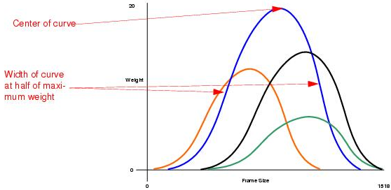

# Gaussian Distribution

Gaussian Frame Size distribution is the superposition of all gaussian distributions. User can specify the center (i.e. **mean**), width of half maximum (i.e. **standard deviation**), and weight of each gaussian distribution. The distribution is then normalized to a single distribution and generates the random numbers according to the normalized distribution

The graphic below shows four Gaussian distributions, reflected as weight over frame size. The frame size, represented at the top of the curve is the frame size most likely to be transmitted, while the frame sizes at the beginning and end of each curve are the least likely to be transmitted. 

The four curves are combined into a single distribution by the port. It is not necessary to use all four curves; one, two, or three curves can be generated as well as four.

